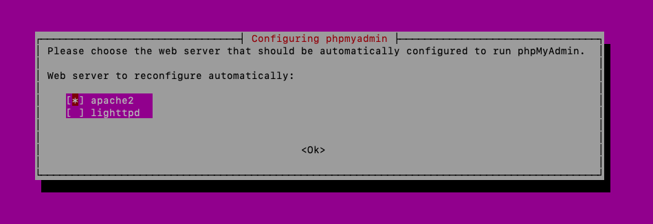
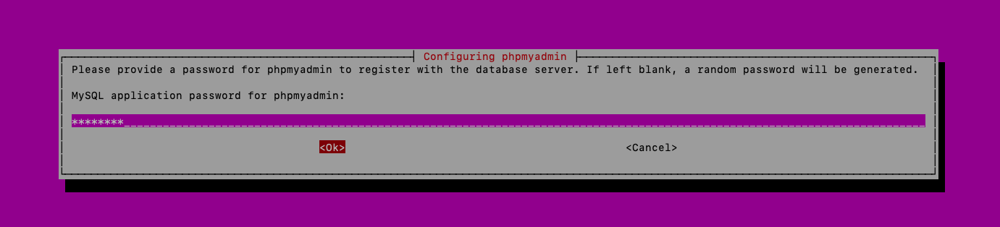
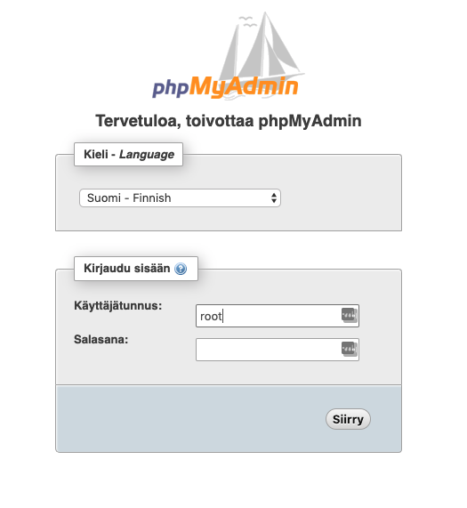
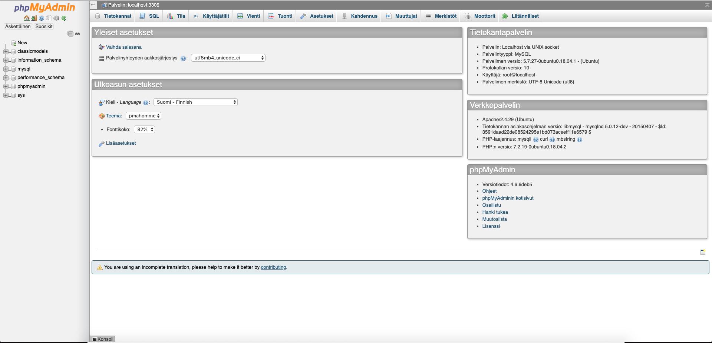

# PhpMyAdmin työkalun asentaminen

Anna seuraavat komennot palvelimella ja PhpMyAdmin työkalu asentuu melko vaivattomasti. https://www.phpmyadmin.net/

Seuraavien vaiheiden ohjeet perustuvat Digital Oceanin ohjeistukseen. Lue siis tarvittaessa lisää osoitteesta https://www.digitalocean.com/community/tutorials/how-to-install-and-secure-phpmyadmin-on-ubuntu-18-04

**Vinkki!** PhpMyAdmin on palvelimelle asennettava PHP sovellus. Voit myös yhdistää muilla Mysql -tietokantaa tukevilla ohjelmilla ja hallita tietokantaa.

## PhpMyAdmin -asennus

Yhdistä ensin palvelimelle `ssh` -päätteellä. Anna sitten alla olevat komennot.

> `sudo apt install phpmyadmin php-mbstring php-gettext`

Yllä oleva komento asentaa phpmyadmin paketin ja sen riippuvuudet. Asennus tarvitsee toimiakseen PHP:n kääntäjän ja Apache -palvelimen. Kaikki tulee edellisen komennon mukana ellei niitä jo etukäteen ole asennettu palvelimelle.

Kun sinulta kysytään mitä palvelinta käytetään niin valitse `apache2`. Valinta tehdään painamalla **VÄLILYÖNTIÄ**. Nuolilla voit liikkua valintojen välillä. **TAB/SARKAIMELLA** voit valita OK ja painaa **ENTER**.

Vastaa `dbconfig-common` kysymyseen `YES`.

Lopuksi sinulta kysytään vielä salasana **phpmyadmin** nimiselle käyttäjälle. Muista ottaa salasana talteen varmuudenvuoksi, vaikka nyt et sitä tarvitse.

> `sudo phpenmod mbstring`

Otetaan käyttöön PHP:n mbstring lisäosa, jota PhpMyAdmin tarvitsee toimiakseen.

> `sudo systemctl restart apache2`

Käynnistä Apache palvelu uudelleen, jotta muutokset tulevat voimaan.

**Vinkki!** Myös komento `sudo service apache2 status` kertoo onko Apache palvelu missä tilassa.

Seuraavaksi kokeile mennä selaimella osoitteeseen: `http://<virtuaalikoneen ip-osoite>/phpmyadmin`

Sinulle kuuluisi aueta kirjautumis-ikkuna PhpMyAdmin asennukseen. Et voi kirjautua vielä sisälle, joten jatkamme seuraavassa osassa.

## Salli Mysql root käyttäjän kirjautuminen

Kirjaudu ensin mysql -palveluun root käyttäjänä komennolla:

> `mysql -h 127.0.0.1 -u root -p`

**Vinkki!** Jos komento ei toimi, kokeile myös `sudo mysql -u root -p`

Tämän jälkeen anna alla olevat komennot mysql -päätteessä:

> `mysql> SELECT user,authentication_string,plugin,host FROM mysql.user;`

Tarkista edellisen komennon tulosteesta, että rivillä `root` lukee `auth_socket` plugin sarakkeessa.

> `mysql> ALTER USER 'root'@'localhost' IDENTIFIED WITH mysql_native_password BY 'password';`

Huomaa edellisessä komennossa kohta **password**. Aseta tämän tilalle siis haluamasi salasana. Älä käytä password salasanana!

> `mysql> FLUSH PRIVILEGES;`

> `mysql> SELECT user,authentication_string,plugin,host FROM mysql.user;`

Tarkista uudelleen tulosteesta, että nyt `root` rivillä lukee `mysql_native_password`

Poistu komennolla: 

> `mysql> exit`

Seuraavaksi kokeile mennä selaimella osoitteeseen: `http://<virtuaalikoneen ip-osoite>/phpmyadmin` ja kirjaudu root tunnuksella sekä äsken antamallasi salasanalla.

