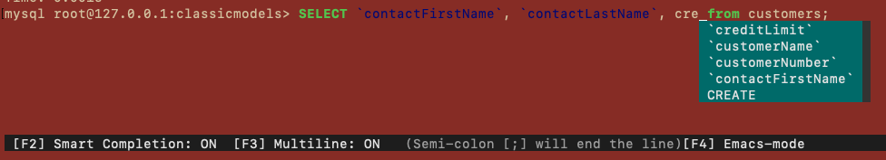

# Mycli työkalun asennus

Mycli on eräänlainen mysql -komentokehote mutta tarjoaa muutamia hyödyllisiä ominaisuuksia kuten autocomletetion komentoja kirjoittaessa.

Asennusohjeet löytyvät seuraavasta linkistä: https://www.mycli.net/install

