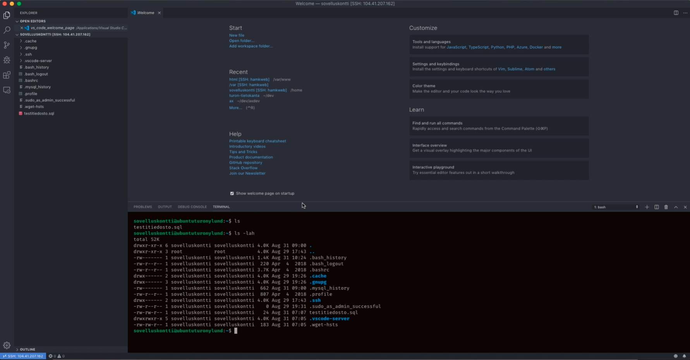
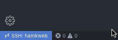

# VS Code ja Remote Development lisäosa

Katso alla oleva video aiheesta. Videon jälkeen dokumenttiin on mahdollisesti lisätty muita huomioita.

[Youtube: VS Code ja SSH etäyhteys](https://youtu.be/qddsfonjxmE)

## Muita huomioita

- `Windows: ctrl + P`
- `Mac: cmd + P`

Edellä mainituilla komennoilla saat ns. komentoikkunan auki VS Code työkalussa.

`> Close Remote Connection`

Löydä edellä mainitun komennon VS Coden komentoikkunasta. Kyseinen komento sulkee SSH yhteyden mutta se menee kyllä poikki itsekseen kun suljet työkalun. Joskus tulee tarpeeseen.

Voit myös painaa ylläolevan kuvan mukaista sinistä painiketta työkalun vasemmassa alareunassa. Se aukausee komentoikkunan.