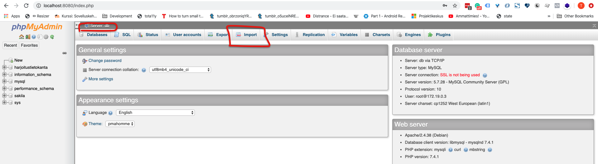
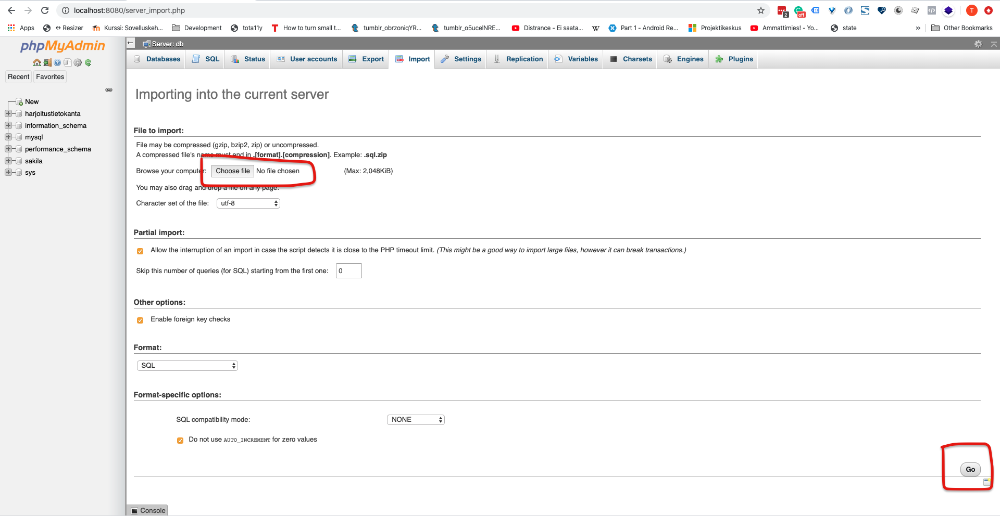

# Sakila -harjoitustietokannan käyttöönotto

Harjoituksissa käytetään Sakila -tietokantaa, jonka käyttöönoton ohjeistus löytyy osoitteesta https://dev.mysql.com/doc/sakila/en/sakila-installation.html

Ohjeessa on heti alkuun mainittu seuraava osoite https://dev.mysql.com/doc/index-other.html

Alkuperäisen ja mahdollisesti ajantasaisen tietokannan voit aina ladata sieltä. Sivulla on mainittu taulukossa **sakila database**, josta on hyvä ladata ZIP -tiedosto.

**Seuraava ohje käy läpi asennuksen käyttämällä tämän repositoryn sisältämää kopiota. Valitse toinen vaihtoehdoista, molemmat tekevät saman asian.**

## Ensimmäinen tapa (mysql bash)

> Suositeltu tapa, koska toimii varmimmin erilaisissa ympäristöissä. Voit kokeilla, että mysql -pääteohjelma on asennettu antamalla komennon **mysql --version**

Lataa ja purkaa ensin harjoitustietokanta yllämainitusta lähteestä. Vaihtoehtoisesti löydät samat tiedosto tämän repositoryn polusta: `docker-mysql/sakiladb/`

Sinulla pitäisi olla kaksi eri tiedostoa:

- `01-sakila-schema.sql` (tietokannan rakenne)
- `02-sakila-data.sql` (esimerkkidata)

> Jos latasit tiedostot alkuperäisestä lähteestä niin ne ovat nimetty paketin purettua seuraavasti: *sakila-schema.sql* ja *sakila-data.sql*

Seuraavaksi palautamme tietokannan ladatusta varmuuskopiosta. Se onnistuu alla olevilla komennoilla. Huomioi kuitenkin, että muuta tarvittaessa komentoihin tulevat osoitteet ja käyttäjänimet vastaamaan sinun omaa ympäristöäsi.

**Seuraava komento luo Sakila tietokannan rakenteen.**

`mysql -h 127.0.0.1 --port=3306 -u root -p < docker-mysql/sakiladb/01-sakila-schema.sql`

```
# mysql -komennon parametrit selitettynä

-h tarkoittaa ip osoitetta, jossa tietokantapalvelin sijaitsee. Paikallinen tietokantapalvelin on aina osoitteessa localhost tai 127.0.0.1

--port tarkoittaa porttia, jossa tietokantapalvelin sijaitsee. Oletuksena se on 3306, jos ei ole muutettu.

-u tarkoittaa tietokannan käyttäjää, jolla tunnistaudutaan ja ajetaan komennot. Esimerkissä käytämmä root käyttäjää.

-p tarkoittaa, että tunnistautumisen yhteydessä kysytään salasanaa.

< (pienempi kuin merkki) tarkoittaa tiedon lukemista jostakin lähteestä. Nuolen perässä oleva oleva tiedostopolku toimii tässä siis lähteenä. Yksinkertaistettuna se tarkoittaa, että luetaan SQL komennot annetusta tiedostosta suoraan mysql komentokehotteeseen.
```

**Seuraava komento lisää tietoja tietokantaan**

`mysql -h 127.0.0.1 --port=3306 -u root -p < docker-mysql/sakiladb/02-sakila-data.sql`

Jos komentojen suoritusten aikana ei tullut virheitä niin sinulla pitäisi olla *sakila* -niminen tietokanta luotuna, joka sisältää kaiken tarvittavan tiedon harjoitusten tekoon.

Voit tarkistaa tietokannan sisällön haluamallasi ohjelmalla.

## Toinen tapa (PHPMyAdmin)

> Huomioi, että ei aina toimi kaikkien SQL palautustiedostojen kanssa.

Lataa ensin harjoitustietokanta repositoryn polusta: `docker-mysql/sakiladb/`

Sinulla pitäisi olla yksi tiedosto:

- `03-sakila-schema-and-data-phpmyadmin.sql` (tietokannan rakenne ja esimerkkidata ZIP -tiedostossa)

> Edellä mainittua tiedostoa ei löydy alkuperäisestä Sakilan lähteestä, koska on tehty erikseen tätä tehtävää varten PHPMyAdmin työkalulla.

Ensimmäiseksi kirjaudu sisälle PHPMyAdmin -ohjelmaasi. Kun olet kirjautuneena niin paina tietojen tuonti -painiketta.

Varmista, että olen ns. aloitusnäkymässä painamalla kuvassa näkyvää **Server: db** kohtaa ylälaidasta. Voi olla eri niminen sinulla.

Sen jälkeen löydät kuvassa olevan **Import (tuonti)** painikkeen.



Aukeavasta ikkunasta valitse yllä mainittu ZIP tiedosto ja paina oikeassa alakulmassa olevaa **Go** -painiketta.

Jos virheitä ei näy niin päivitä sivu ja katso vasenta reunaa, jossa näkyy tietokantojen nimiä. Sinun kuuluisi nähdä tietokanta nimeltään **Sakila**.

