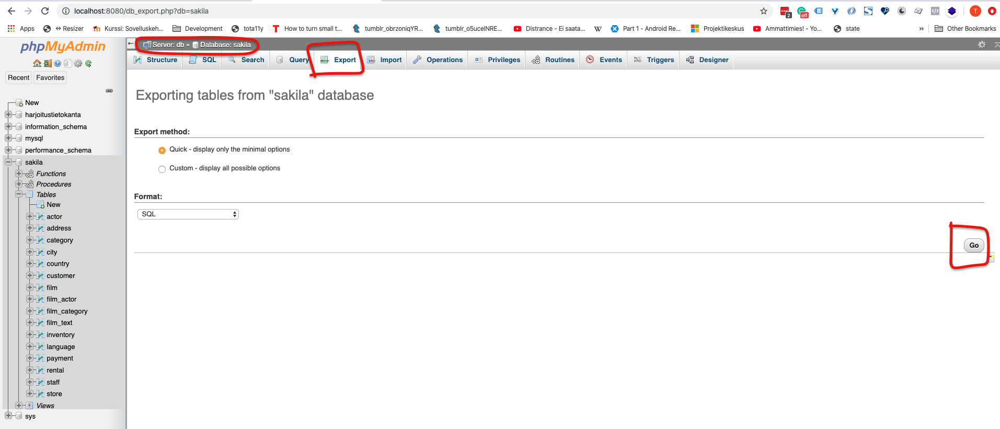

# Tietokannan varmuuskopiointi

Tietokannan varmuuskopiointi on tärkeä asia huomioida. Ohjeessa käydään kaksi erilaista tapaa ottaa varmuuskopio Mysql tietokannasta.

## Ensimmäinen tapa (mysqldump)

> Suositeltu tapa, koska toimii varmimmin erilaisissa ympäristöissä.

Seuraavia komentoja kokeillessa sinulla pitää olla jokin tietokanta olemasa, jonka haluat varmuuskopioida.

Varmuuskopiointi tapahtuu käyttäen mysqldump -ohjelmistoa. Voit kokeilla komentokehotteessa, että työkalu on asennettu antamalla seuraavan komennon eikä virheitä tulostu.

`mysqldump --version`

**Seuraava komento luo tietokannan palautustiedoston**

`mysqldump -h 127.0.0.1 --port=3306 -u root -p sakila > tietokannan_varmuuskopio.sql`

```
# mysqldump -komennon parametrit selitettynä

-h tarkoittaa ip osoitetta, jossa tietokantapalvelin sijaitsee. Paikallinen tietokantapalvelin on aina osoitteessa localhost tai 127.0.0.1

--port tarkoittaa porttia, jossa tietokantapalvelin sijaitsee. Oletuksena se on 3306, jos ei ole muutettu.

-u tarkoittaa tietokannan käyttäjää, jolla tunnistaudutaan ja ajetaan komennot. Esimerkissä käytämmä root käyttäjää.

-p tarkoittaa, että tunnistautumisen yhteydessä kysytään salasanaa.

> (suurempi kuin merkki) tarkoittaa tiedon kirjoittamista tiedostoon. Tässä tilanteessa mysqldump tekemä tulosta kirjoitetaan annettuun tiedostoon, joten vaihda tiedoston nimi haluamaksesi.
```

## Toinen tapa (PHPMyAdmin)

PHPMyAdmin -ohjelmistolla tietokannan varmuuskopiointi onnistuu seuraavalla tavalla.

- Valitse ensin tietokanta vasemmasta listalta klikkaamalla sitä.
- Valitse **Export (vienti)** välilehti.
- Aukeavasta näkymästä voit valita **Quick** -vaihtoehdon ja lopuksi painaa **Go**.

> Custom -vaihtoehto tarjoaa erilaisia vaihtoehtoja mitä tietoja ja komentoja tullaan sisältämään luotavaan palautustiedostoon. Esimerkiksi jos halutaan vain tallentaa pelkkä rakenne eikä varsinaisia tietokannan sisältämiä tietoja.


